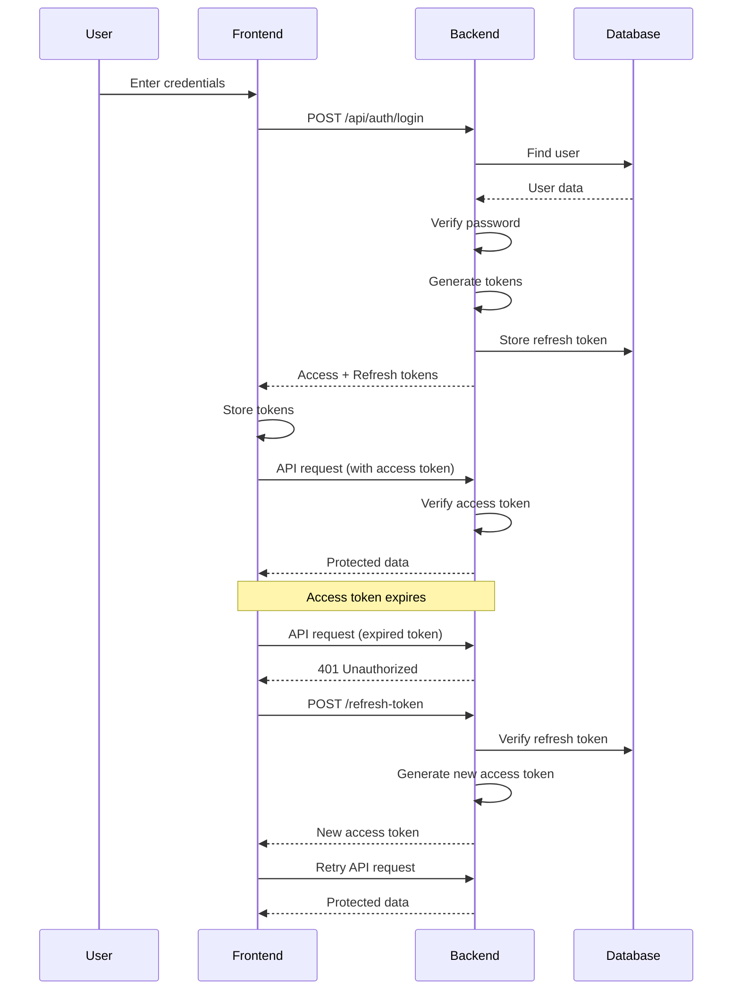

# Authentication Guide (JWT with Refresh Tokens)

This guide covers implementing secure JWT-based authentication with refresh tokens, password hashing, and protected routes.

## 🎯 Overview

We'll implement:
- **Access Tokens** - Short-lived (1 hour) for API requests
- **Refresh Tokens** - Long-lived (7 days) for getting new access tokens
- **Password Hashing** - bcrypt for secure password storage
- **Protected Routes** - Middleware for authenticated endpoints
- **Token Refresh Flow** - Automatic token renewal

---

## 🔐 Authentication Flow Diagram

```
┌─────────────┐
│   Signup    │
└──────┬──────┘
       │
       ├─ Hash password
       ├─ Create user
       ├─ Generate access token (1h)
       ├─ Generate refresh token (7d)
       └─ Store refresh token in DB
       
┌─────────────┐
│    Login    │
└──────┬──────┘
       │
       ├─ Find user
       ├─ Verify password
       ├─ Generate access token (1h)
       ├─ Generate refresh token (7d)
       └─ Store refresh token in DB

┌─────────────────┐
│  API Request    │
└────────┬────────┘
         │
         ├─ Check access token
         ├─ If expired → use refresh token
         ├─ Generate new access token
         └─ Continue request

┌─────────────┐
│   Logout    │
└──────┬──────┘
       │
       └─ Revoke refresh token in DB
```

---

## 📦 Backend Implementation

### Step 1: Install Dependencies

```bash
cd server
npm install bcryptjs jsonwebtoken
npm install -D @types/bcryptjs @types/jsonwebtoken
```

---

### Step 2: Create JWT Utilities

Create `server/src/lib/jwt.ts`:

```typescript
// ============================================================================
// Imports
// ============================================================================

import jwt from 'jsonwebtoken';

// ============================================================================
// Configuration
// ============================================================================

const JWT_SECRET = process.env.JWT_SECRET || 'your-secret-key-change-in-production';
const ACCESS_TOKEN_EXPIRY = '1h';
const REFRESH_TOKEN_EXPIRY = '7d';

// ============================================================================
// Types
// ============================================================================

interface TokenPayload {
  userId: string;
}

// ============================================================================
// Token Generation
// ============================================================================

export function generateAccessToken(userId: string): string {
  return jwt.sign({ userId }, JWT_SECRET, {
    expiresIn: ACCESS_TOKEN_EXPIRY,
  });
}

export function generateRefreshToken(userId: string): string {
  return jwt.sign({ userId }, JWT_SECRET, {
    expiresIn: REFRESH_TOKEN_EXPIRY,
  });
}

export function generateTokenPair(userId: string) {
  return {
    accessToken: generateAccessToken(userId),
    refreshToken: generateRefreshToken(userId),
  };
}

// ============================================================================
// Token Verification
// ============================================================================

export function verifyToken(token: string): TokenPayload | null {
  try {
    const decoded = jwt.verify(token, JWT_SECRET) as TokenPayload;
    return decoded;
  } catch (error) {
    return null;
  }
}

// ============================================================================
// Token Expiry Calculation
// ============================================================================

export function getRefreshTokenExpiry(): Date {
  return new Date(Date.now() + 7 * 24 * 60 * 60 * 1000); // 7 days
}
```

---

### Step 3: Create Password Utilities

Create `server/src/lib/password.ts`:

```typescript
// ============================================================================
// Imports
// ============================================================================

import bcrypt from 'bcryptjs';

// ============================================================================
// Configuration
// ============================================================================

const SALT_ROUNDS = 10;

// ============================================================================
// Password Hashing
// ============================================================================

export async function hashPassword(password: string): Promise<string> {
  return bcrypt.hash(password, SALT_ROUNDS);
}

// ============================================================================
// Password Verification
// ============================================================================

export async function verifyPassword(
  password: string,
  hashedPassword: string
): Promise<boolean> {
  return bcrypt.compare(password, hashedPassword);
}

// ============================================================================
// Password Strength Validation
// ============================================================================

export function validatePasswordStrength(password: string): {
  valid: boolean;
  errors: string[];
} {
  const errors: string[] = [];

  if (password.length < 8) {
    errors.push('Password must be at least 8 characters');
  }

  if (!/[A-Z]/.test(password)) {
    errors.push('Password must contain at least one uppercase letter');
  }

  if (!/[a-z]/.test(password)) {
    errors.push('Password must contain at least one lowercase letter');
  }

  if (!/[0-9]/.test(password)) {
    errors.push('Password must contain at least one number');
  }

  return {
    valid: errors.length === 0,
    errors,
  };
}
```

---

### Step 4: Create Auth Middleware

Create `server/src/middleware/auth.ts`:

```typescript
// ============================================================================
// Imports
// ============================================================================

import { Request, Response, NextFunction } from 'express';
import { verifyToken } from '../lib/jwt';
import prisma from '../db';

// ============================================================================
// Extend Express Request Type
// ============================================================================

declare global {
  namespace Express {
    interface Request {
      userId?: string;
      userRole?: string;
    }
  }
}

// ============================================================================
// Middleware - Authenticate Token
// ============================================================================

export async function authenticateToken(
  req: Request,
  res: Response,
  next: NextFunction
) {
  try {
    // Get token from header
    const authHeader = req.headers['authorization'];
    const token = authHeader && authHeader.split(' ')[1]; // Bearer TOKEN

    if (!token) {
      res.status(401).json({ error: 'Access token required' });
      return;
    }

    // Verify token
    const decoded = verifyToken(token);

    if (!decoded) {
      res.status(401).json({ error: 'Invalid or expired token' });
      return;
    }

    // Get user from database
    const user = await prisma.user.findUnique({
      where: { id: decoded.userId },
      select: { id: true, role: true },
    });

    if (!user) {
      res.status(401).json({ error: 'User not found' });
      return;
    }

    // Attach user info to request
    req.userId = user.id;
    req.userRole = user.role;

    next();
  } catch (error) {
    console.error('Auth middleware error:', error);
    res.status(401).json({ error: 'Authentication failed' });
  }
}

// ============================================================================
// Middleware - Require Admin Role
// ============================================================================

export function requireAdmin(req: Request, res: Response, next: NextFunction) {
  if (req.userRole !== 'ADMIN' && req.userRole !== 'SUPERADMIN') {
    res.status(403).json({ error: 'Admin access required' });
    return;
  }
  next();
}

// ============================================================================
// Middleware - Require Superadmin Role
// ============================================================================

export function requireSuperadmin(req: Request, res: Response, next: NextFunction) {
  if (req.userRole !== 'SUPERADMIN') {
    res.status(403).json({ error: 'Superadmin access required' });
    return;
  }
  next();
}
```

---

### Step 5: Implement Auth Routes

Update `server/src/routes/auth.ts`:

```typescript
// ============================================================================
// Imports
// ============================================================================

import { Router, Request, Response } from 'express';
import prisma from '../db';
import { hashPassword, verifyPassword } from '../lib/password';
import { generateTokenPair, verifyToken, getRefreshTokenExpiry } from '../lib/jwt';

const router = Router();

// ============================================================================
// Types
// ============================================================================

interface SignupBody {
  email: string;
  password: string;
  name: string;
  username?: string;
}

interface LoginBody {
  email: string;
  password: string;
}

// ============================================================================
// Routes - POST /api/auth/signup
// ============================================================================

router.post('/signup', async (req: Request<{}, {}, SignupBody>, res: Response) => {
  try {
    const { email, password, name, username } = req.body;

    // Validate input
    if (!email || !password || !name) {
      res.status(400).json({ error: 'Missing required fields' });
      return;
    }

    // Check if user exists
    const existingUser = await prisma.user.findUnique({
      where: { email },
    });

    if (existingUser) {
      res.status(400).json({ error: 'User already exists' });
      return;
    }

    // Hash password
    const hashedPassword = await hashPassword(password);

    // Create user
    const user = await prisma.user.create({
      data: {
        email,
        password: hashedPassword,
        name,
        username,
        role: 'USER',
      },
    });

    // Generate tokens
    const { accessToken, refreshToken } = generateTokenPair(user.id);

    // Store refresh token
    await prisma.refreshToken.create({
      data: {
        token: refreshToken,
        userId: user.id,
        expiresAt: getRefreshTokenExpiry(),
      },
    });

    // Return response
    res.status(201).json({
      user: {
        id: user.id,
        email: user.email,
        name: user.name,
        username: user.username,
        role: user.role,
      },
      accessToken,
      refreshToken,
    });
  } catch (error) {
    console.error('Signup error:', error);
    res.status(500).json({ error: 'Failed to create user' });
  }
});

// ============================================================================
// Routes - POST /api/auth/login
// ============================================================================

router.post('/login', async (req: Request<{}, {}, LoginBody>, res: Response) => {
  try {
    const { email, password } = req.body;

    // Find user
    const user = await prisma.user.findUnique({
      where: { email },
    });

    if (!user) {
      res.status(401).json({ error: 'Invalid credentials' });
      return;
    }

    // Verify password
    const validPassword = await verifyPassword(password, user.password);

    if (!validPassword) {
      res.status(401).json({ error: 'Invalid credentials' });
      return;
    }

    // Generate tokens
    const { accessToken, refreshToken } = generateTokenPair(user.id);

    // Store refresh token
    await prisma.refreshToken.create({
      data: {
        token: refreshToken,
        userId: user.id,
        expiresAt: getRefreshTokenExpiry(),
      },
    });

    // Return response
    res.json({
      user: {
        id: user.id,
        email: user.email,
        name: user.name,
        username: user.username,
        role: user.role,
        profilePicture: user.profilePicture,
      },
      accessToken,
      refreshToken,
    });
  } catch (error) {
    console.error('Login error:', error);
    res.status(500).json({ error: 'Failed to login' });
  }
});

// ============================================================================
// Routes - POST /api/auth/refresh-token
// ============================================================================

router.post('/refresh-token', async (req: Request, res: Response) => {
  try {
    const { refreshToken } = req.body;

    if (!refreshToken) {
      res.status(401).json({ error: 'Refresh token required' });
      return;
    }

    // Verify token
    const decoded = verifyToken(refreshToken);

    if (!decoded) {
      res.status(401).json({ error: 'Invalid refresh token' });
      return;
    }

    // Check if token exists in database
    const storedToken = await prisma.refreshToken.findUnique({
      where: { token: refreshToken },
    });

    if (!storedToken || storedToken.expiresAt < new Date()) {
      res.status(401).json({ error: 'Invalid or expired refresh token' });
      return;
    }

    // Generate new access token (keep same refresh token)
    const newAccessToken = generateAccessToken(decoded.userId);

    res.json({ accessToken: newAccessToken });
  } catch (error) {
    console.error('Refresh token error:', error);
    res.status(401).json({ error: 'Invalid refresh token' });
  }
});

// ============================================================================
// Routes - POST /api/auth/logout
// ============================================================================

router.post('/logout', async (req: Request, res: Response) => {
  try {
    const { refreshToken } = req.body;

    if (refreshToken) {
      // Revoke refresh token
      await prisma.refreshToken.deleteMany({
        where: { token: refreshToken },
      });
    }

    res.json({ message: 'Logged out successfully' });
  } catch (error) {
    console.error('Logout error:', error);
    res.status(500).json({ error: 'Failed to logout' });
  }
});

// ============================================================================
// Export
// ============================================================================

export default router;
```

---

### Step 6: Protect Routes

Example protected route:

```typescript
// server/src/routes/users.ts

import { Router } from 'express';
import { authenticateToken, requireAdmin } from '../middleware/auth';
import prisma from '../db';

const router = Router();

// Public route (no auth required)
router.get('/public', async (req, res) => {
  res.json({ message: 'This is public' });
});

// Protected route (login required)
router.get('/me', authenticateToken, async (req, res) => {
  const user = await prisma.user.findUnique({
    where: { id: req.userId },
    select: {
      id: true,
      email: true,
      name: true,
      username: true,
      role: true,
      profilePicture: true,
    },
  });

  res.json(user);
});

// Admin-only route
router.get('/', authenticateToken, requireAdmin, async (req, res) => {
  const users = await prisma.user.findMany({
    select: {
      id: true,
      email: true,
      name: true,
      role: true,
    },
  });

  res.json(users);
});

export default router;
```

---

## 🎨 Frontend Implementation

### Step 1: Token Storage

Store tokens in localStorage (or use httpOnly cookies for better security):

```typescript
// After login/signup
localStorage.setItem('accessToken', data.accessToken);
localStorage.setItem('refreshToken', data.refreshToken);

// Get tokens
const accessToken = localStorage.getItem('accessToken');
const refreshToken = localStorage.getItem('refreshToken');

// Clear tokens
localStorage.removeItem('accessToken');
localStorage.removeItem('refreshToken');
```

---

### Step 2: API Helper with Auto-Refresh

```typescript
// src/lib/api.ts

export async function fetchWithAuth(url: string, options: RequestInit = {}) {
  const accessToken = localStorage.getItem('accessToken');

  const headers = {
    'Content-Type': 'application/json',
    ...(accessToken ? { 'Authorization': `Bearer ${accessToken}` } : {}),
    ...options.headers,
  };

  let response = await fetch(`${API_URL}${url}`, {
    ...options,
    headers,
  });

  // If token expired, try to refresh
  if (response.status === 401) {
    const refreshed = await refreshAccessToken();

    if (refreshed) {
      // Retry with new token
      const newAccessToken = localStorage.getItem('accessToken');
      const newHeaders = {
        ...headers,
        'Authorization': `Bearer ${newAccessToken}`,
      };

      response = await fetch(`${API_URL}${url}`, {
        ...options,
        headers: newHeaders,
      });
    } else {
      // Refresh failed, redirect to login
      localStorage.clear();
      window.location.href = '/login';
      throw new Error('Session expired');
    }
  }

  return response;
}

async function refreshAccessToken(): Promise<boolean> {
  const refreshToken = localStorage.getItem('refreshToken');

  if (!refreshToken) return false;

  try {
    const response = await fetch(`${API_URL}/api/auth/refresh-token`, {
      method: 'POST',
      headers: { 'Content-Type': 'application/json' },
      body: JSON.stringify({ refreshToken }),
    });

    if (response.ok) {
      const { accessToken } = await response.json();
      localStorage.setItem('accessToken', accessToken);
      return true;
    }
  } catch (error) {
    console.error('Token refresh failed:', error);
  }

  return false;
}
```

---

## 🔒 Security Best Practices

### 1. Environment Variables

```env
# NEVER commit this file!
JWT_SECRET="use-a-long-random-string-at-least-32-characters"
```

Generate a secure secret:
```bash
node -e "console.log(require('crypto').randomBytes(32).toString('hex'))"
```

### 2. HTTPS Only (Production)

```typescript
// Only send tokens over HTTPS
if (process.env.NODE_ENV === 'production') {
  app.use((req, res, next) => {
    if (!req.secure) {
      return res.redirect('https://' + req.headers.host + req.url);
    }
    next();
  });
}
```

### 3. httpOnly Cookies (More Secure than localStorage)

```typescript
// Set cookie
res.cookie('refreshToken', refreshToken, {
  httpOnly: true,
  secure: process.env.NODE_ENV === 'production',
  sameSite: 'strict',
  maxAge: 7 * 24 * 60 * 60 * 1000, // 7 days
});

// Clear cookie
res.clearCookie('refreshToken');
```

### 4. Rate Limiting

```bash
npm install express-rate-limit
```

```typescript
import rateLimit from 'express-rate-limit';

const loginLimiter = rateLimit({
  windowMs: 15 * 60 * 1000, // 15 minutes
  max: 5, // 5 requests per window
  message: 'Too many login attempts, please try again later',
});

router.post('/login', loginLimiter, async (req, res) => {
  // ...
});
```

---

## ✅ Security Checklist

- [ ] JWT_SECRET is strong and stored in environment variables
- [ ] Passwords are hashed with bcrypt (minimum 10 rounds)
- [ ] Access tokens have short expiry (1 hour or less)
- [ ] Refresh tokens are stored in database
- [ ] Revoked refresh tokens are deleted from database
- [ ] HTTPS enforced in production
- [ ] Rate limiting on auth endpoints
- [ ] Input validation on all endpoints
- [ ] No sensitive data in JWT payload
- [ ] Tokens are cleared on logout

---

## 📚 Testing Authentication

### Test Signup
```bash
curl -X POST http://localhost:3000/api/auth/signup \
  -H "Content-Type: application/json" \
  -d '{
    "email": "test@example.com",
    "password": "Password123",
    "name": "Test User"
  }'
```

### Test Login
```bash
curl -X POST http://localhost:3000/api/auth/login \
  -H "Content-Type: application/json" \
  -d '{
    "email": "test@example.com",
    "password": "Password123"
  }'
```

### Test Protected Route
```bash
curl http://localhost:3000/api/users/me \
  -H "Authorization: Bearer YOUR_ACCESS_TOKEN"
```

### Test Token Refresh
```bash
curl -X POST http://localhost:3000/api/auth/refresh-token \
  -H "Content-Type: application/json" \
  -d '{"refreshToken": "YOUR_REFRESH_TOKEN"}'
```

---

## 💡 Common Issues & Solutions

### Issue: "Invalid token" on valid requests
**Solution:** Check JWT_SECRET is the same in all environments

### Issue: Tokens not refreshing
**Solution:** Verify refresh token is stored in database and not expired

### Issue: "User not found" after signup
**Solution:** Check Prisma schema has all required fields

### Issue: CORS errors on login
**Solution:** Configure CORS to allow credentials:
```typescript
app.use(cors({
  origin: process.env.FRONTEND_URL,
  credentials: true,
}));
```

---

## 🎯 Complete Authentication Workflow



---

**All Guides Complete!** 🎉

You now have a complete set of developer guides for building full-stack applications with modern authentication!
