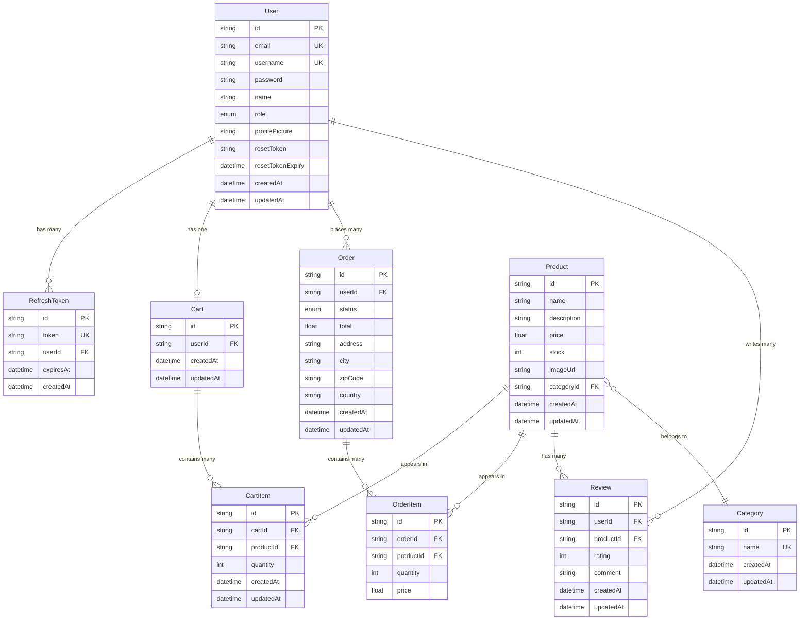

# Database Structure

This diagram shows how the database tables are organized and how they relate to each other.

## Entity Relationship Diagram

## Simple Explanation

Think of the database as a collection of organized boxes (tables) that store information:

### Core Tables

- **User**: Stores user account information (email, password, name, role)
- **Product**: Stores items available for purchase (name, price, description, stock)
- **Category**: Groups products into categories (like "Electronics", "Clothing")

### Shopping Tables

- **Cart**: A shopping cart for each user
- **CartItem**: Individual products added to a cart (with quantity)
- **Order**: A completed purchase with delivery details
- **OrderItem**: Products in a specific order (saved with price at time of purchase)

### Supporting Tables

- **Review**: Customer ratings and comments on products
- **RefreshToken**: Security tokens for keeping users logged in

### Key Relationships

- Each **User** can have ONE **Cart** but MANY **Orders**
- Each **Cart** contains MANY **CartItems** (different products)
- Each **Product** can belong to ONE **Category**
- Each **Order** contains MANY **OrderItems** (snapshot of products at purchase time)
- Users can write MANY **Reviews**, but only ONE review per product
