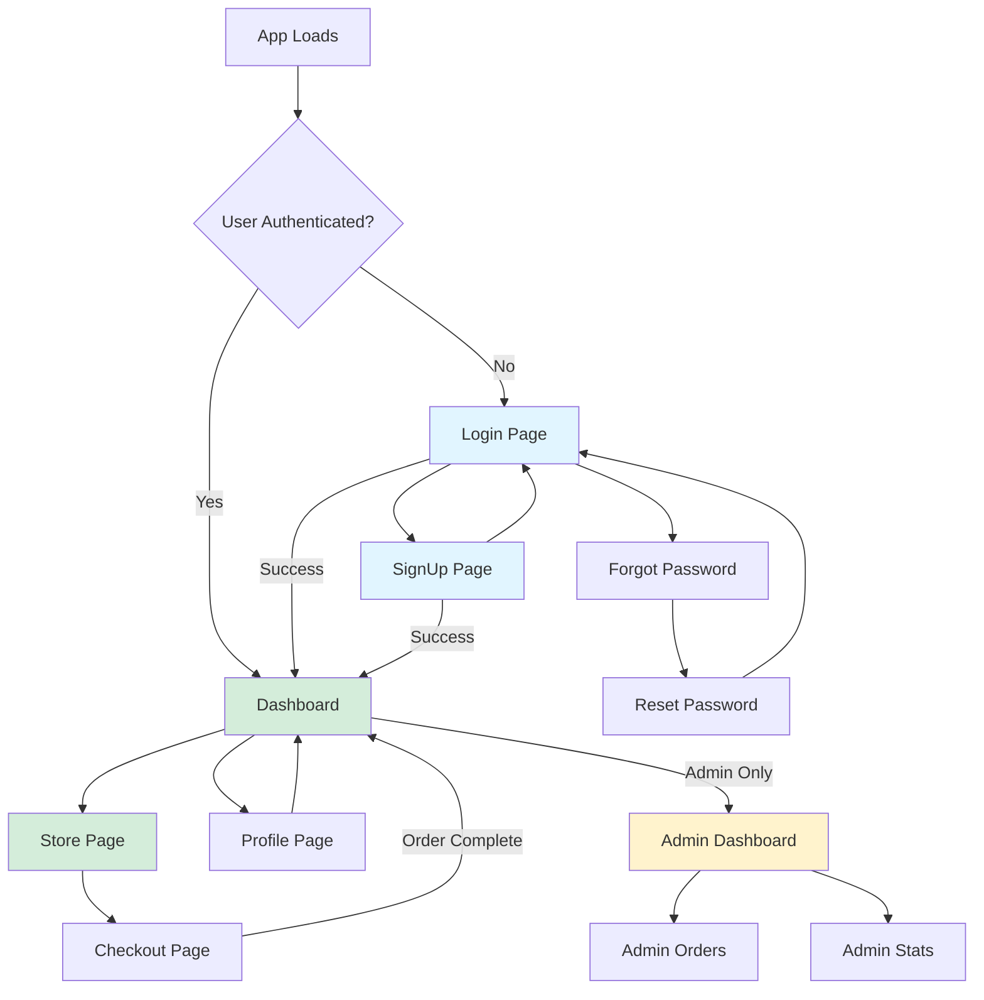
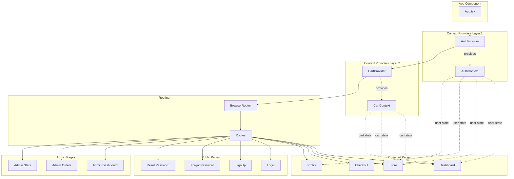
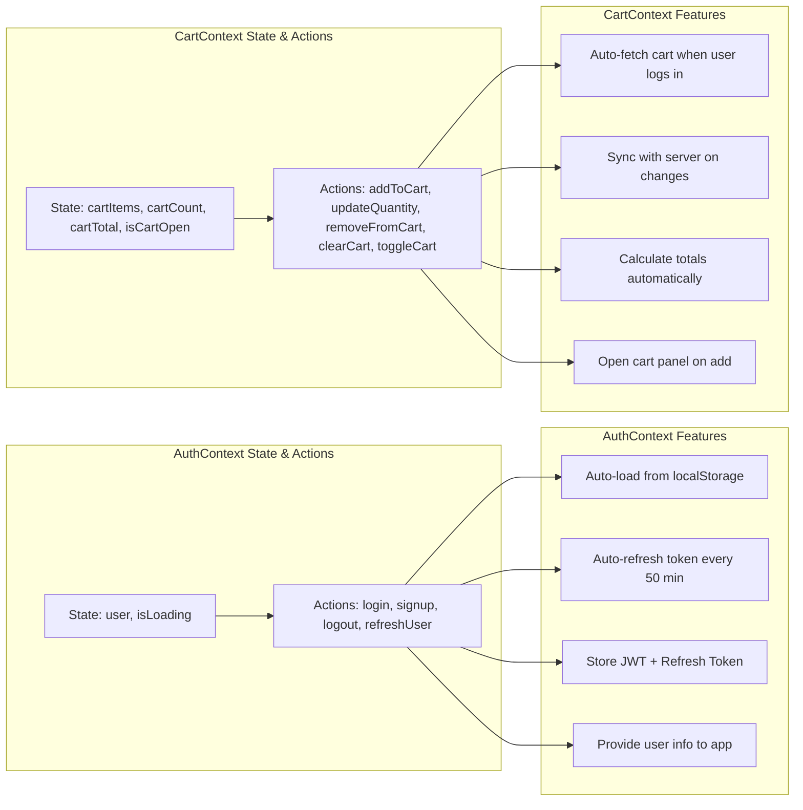

# Frontend Flow

This diagram shows how users navigate through the application and how data flows between components.

## Page Navigation Flow



## State Management Flow



## Context Details



## Simple Explanation

### What is State Management?

State = Data that changes over time (like "is user logged in?" or "what's in the cart?")

Instead of each page asking the server "who is logged in?", we use **Context** to share this information across all pages.

### The Two Main Contexts

#### 1. AuthContext (Authentication)

**What it manages:**
- Current user information (name, email, role)
- Login status (authenticated or not)
- JWT tokens for API requests

**Key features:**
- Automatically restores session when you refresh the page
- Keeps you logged in by refreshing tokens every 50 minutes
- Provides login/signup/logout functions to all pages

**How pages use it:**
```javascript
const { user, login, logout } = useAuth();
// Now any page can check if user is logged in
```

#### 2. CartContext (Shopping Cart)

**What it manages:**
- List of items in cart
- Total number of items
- Total price
- Cart panel open/closed state

**Key features:**
- Automatically fetches cart when user logs in
- Updates server whenever cart changes
- Calculates totals automatically
- Opens cart panel when you add items

**How pages use it:**
```javascript
const { cartItems, cartCount, addToCart } = useCart();
// Now any page can add to cart or see cart count
```

### Page Protection

**ProtectedRoute**: Wrapper that checks if user is logged in
- If YES → Show the page
- If NO → Redirect to login

**AdminRoute**: Checks if user is an admin
- If ADMIN → Show admin page
- If NOT → Redirect to dashboard

### User Journey Example

**New user signs up:**
1. User fills signup form → Calls `signup()` from AuthContext
2. Server creates account → Returns user data + tokens
3. AuthContext saves to localStorage + updates state
4. App detects user is logged in → Redirects to Dashboard
5. CartContext fetches user's cart from server
6. User can now browse store and add items

**User adds to cart:**
1. User clicks "Add to Cart" → Calls `addToCart()` from CartContext
2. CartContext sends request to server
3. Server updates database
4. Server returns updated cart
5. CartContext updates state (cartItems, cartCount, cartTotal)
6. Cart panel opens automatically
7. UI updates to show new count

### Why Use Context?

**Without Context:**
- Each page needs to check login status separately
- Need to pass cart data through many components
- Duplicated code everywhere
- Hard to keep data in sync

**With Context:**
- Check login once, share everywhere
- Cart data available to any component
- Clean, reusable code
- Single source of truth
