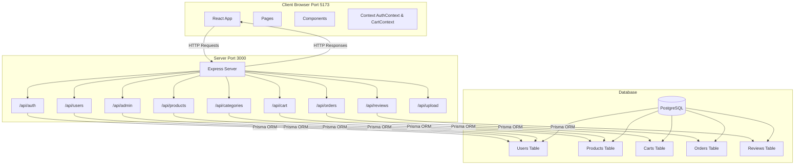
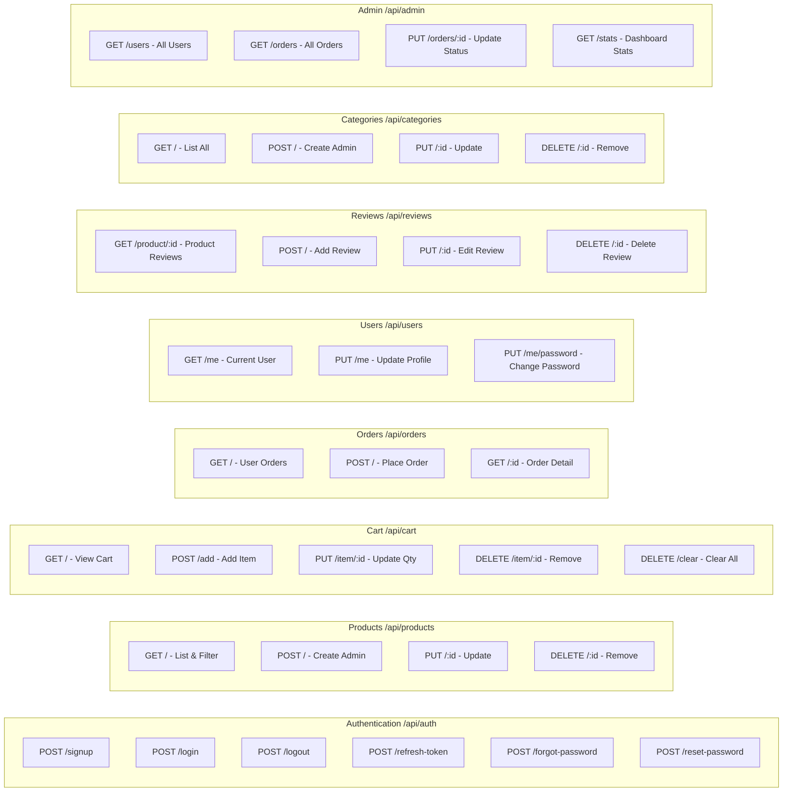

# System Architecture

This diagram shows how the client (browser), server (backend), and database work together.

## System Overview

## API Routes Detail

## Simple Explanation

### How It Works Together

1. **Client (React App)**: This is what users see in their browser
   - Displays pages like Login, Store, Cart, Checkout
   - Manages user state (logged in or not) with AuthContext
   - Manages shopping cart state with CartContext
   - Sends requests to the server when users interact

2. **Server (Express + Node.js)**: The middleman that handles requests
   - Receives requests from the client (like "add to cart")
   - Validates data and checks user permissions
   - Talks to the database using Prisma ORM
   - Sends responses back to the client

3. **Database (PostgreSQL)**: Where all data is stored permanently
   - Stores users, products, carts, orders, reviews
   - Organized in tables with relationships
   - Only the server can access it directly

### Request Flow Example

**User adds product to cart:**

1. User clicks "Add to Cart" button → Client
2. Client calls `CartContext.addToCart()` → Sends POST to `/api/cart/add`
3. Server receives request → Validates user → Checks product exists
4. Server updates database → Adds CartItem record
5. Database confirms → Server retrieves updated cart
6. Server sends back cart data → Client updates UI
7. User sees updated cart count

### Security Layer

- **JWT Tokens**: Used for authentication (stored in localStorage)
- **Refresh Tokens**: Keep users logged in for 7 days
- **User-ID Header**: Sent with requests to identify the user
- **Password Hashing**: Passwords stored securely using bcrypt
